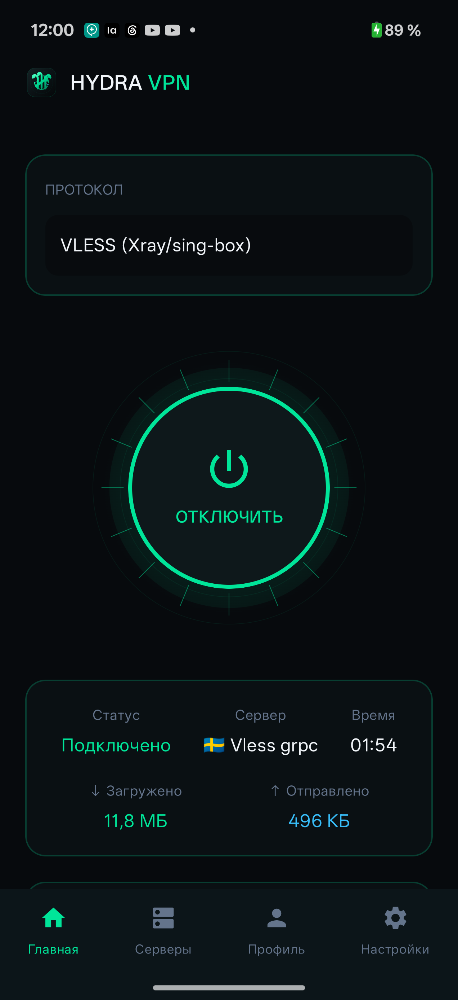
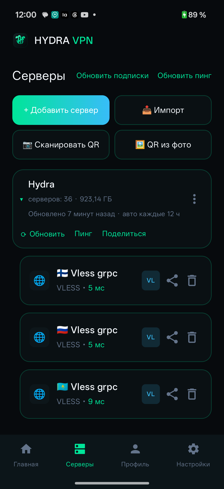
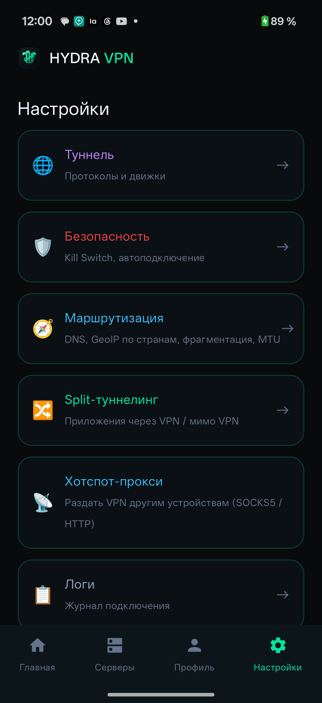
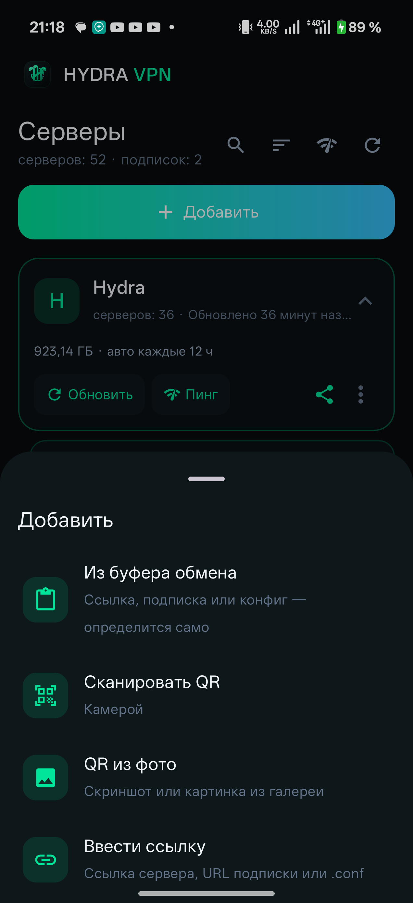
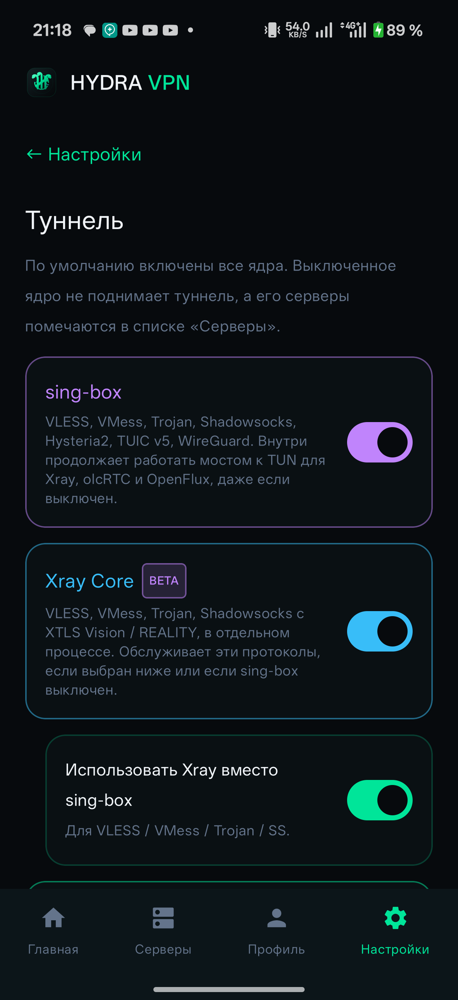
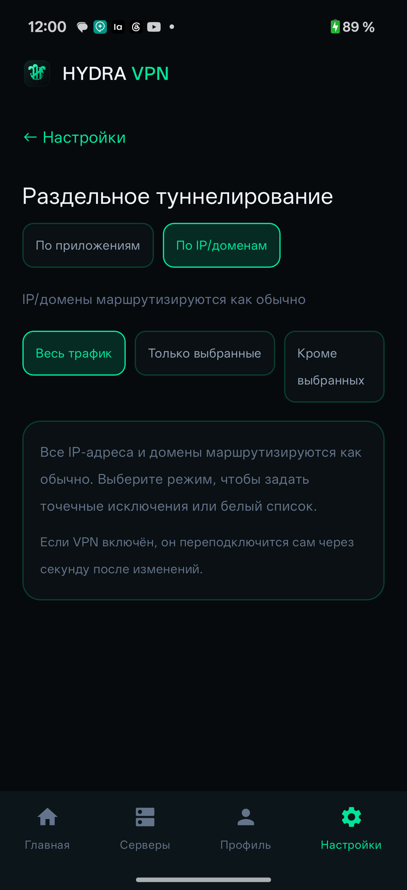

# Hydra

**Мультипротокольный VPN-клиент для Android** на Jetpack Compose.

- Пакет / appId: `ru.gidravpn.hydra` · Лицензия: **GPL-3.0**
- Сайт: https://gidravpn.ru · Telegram: https://t.me/+WWJFBZVhxBs4ZmNi
- Статус: **0.6.22.2**

## Скриншоты

Снято на реальном телефоне (OnePlus CPH2747, Android 16).

| Главная (подключено) | Серверы и подписка | Настройки |
|:---:|:---:|:---:|
|  |  |  |

| Меню «Добавить» | Ядра (Туннель) | Раздельное туннелирование |
|:---:|:---:|:---:|
|  |  |  |

---

## Возможности

- 🎛 **Единый клиент** для нескольких семейств протоколов:
  - proxy (VLESS/VMess/Trojan/Shadowsocks/Hysteria2/TUIC/WireGuard) — sing-box;
  - Xray — альтернативное ядро (XTLS Vision, REALITY);
  - **AmneziaWG 1.0/1.5/2.0** — обфусцированный WireGuard (amneziawg-go);
  - **SSTP** и **L2TP** — реализованы целиком на Kotlin (userspace-PPP),
    без нативных зависимостей и root;
  - olcRTC и OpenFlux — ознакомительные движки (BETA); WDTT не интегрирован (см. docs/ECOSYSTEM.md);
  - PPTP — честный отказ (GRE требует root, стек удалён из Android 12/13).
- 📥 **Импорт**: подписки (base64/список) из панелей x-ui / 3x-ui / PasarGuard /
  Remnawave, одиночные ссылки (`vless:// vmess:// trojan:// ss:// hysteria2://
  tuic:// wireguard:// awg:// sstp:// l2tp://`), `.conf` WireGuard/AmneziaWG,
  deep-links.
- ✂️ **Раздельное туннелирование**: весь трафик / только выбранные приложения /
  кроме выбранных (DataStore + `addAllowed/addDisallowedApplication`).
- 🌗 Тёмный интерфейс на Compose; экран логов, статистика трафика,
  foreground-уведомление.

## Поддержка протоколов

| Протокол | Движок | Статус |
|---|---|---|
| VLESS (+REALITY/Vision), VMess, Trojan, Shadowsocks | sing-box / Xray | конфиг готов, нужен `.aar` |
| Hysteria2, TUIC v5 | sing-box | конфиг готов, нужен `.aar` |
| WireGuard | sing-box | конфиг готов, нужен `.aar` |
| AmneziaWG 1.0/1.5/2.0 | amneziawg-go | `.conf`/uapi готовы, нужен `.aar` |
| **SSTP** (TLS/PPP, MS-CHAPv2, crypto-binding) | userspace (Kotlin) | **реализован**, нужен on-device тест |
| **L2TP** (RFC 2661, без IPsec) | userspace (Kotlin) | **реализован**, нужен on-device тест |
| Xray (альт. ядро) | libXray.aar + tun2socks | каркас, нужен `.aar` |
| WDTT (WG over TURN ВК) | libclient.so | **BETA**, каркас |
| olcRTC (TCP over WebRTC) | olcrtc.aar + tun2socks | **BETA**, каркас |
| PPTP | — | **недоступно**: GRE → root; стек удалён из Android 12/13 |

Полное описание протоколов и ограничений — [docs/PROTOCOLS.md](docs/PROTOCOLS.md),
сервисы — [docs/SERVICES.md](docs/SERVICES.md).

## Быстрый старт

```bash
git clone https://github.com/Chistovik92/HydraVPN.git
cd HydraVPN
# Открыть в Android Studio, либо:
gradle wrapper --gradle-version 8.9
./gradlew :app:assembleStubDebug      # без нативных ядер (симуляция)
```

Для реальных туннелей соберите ядра и положите `.aar`/`.so` в `app/libs/`
(libbox, libXray, amneziawg-go, olcrtc — инструкции: [docs/BUILD.md](docs/BUILD.md)),
затем:

```bash
./gradlew :app:assembleNativeRelease
```

> `gradle-wrapper.jar` в репозиторий не кладётся (бинарник) — CI генерирует
> его сам, локально: `gradle wrapper`.

## Архитектура (кратко)

```
UI (Compose) → MainViewModel → ServerRepository (Room + подписки)
                    │                + SplitTunnelRepository (DataStore)
                    ▼
        HydraVpnService (tun + SocketGuard.protect) → VpnCore
              ├─ SingBoxCore   (libbox.aar; HydraPlatformInterface)
              ├─ XrayCore      (libXray.aar + tun2socks)
              ├─ AmneziaWgCore (amneziawg-go.aar)
              ├─ SstpCore / L2tpCore (userspace PPP: vpn/ppp + TunBridge)
              ├─ PptpCore      (честный отказ GRE)
              ├─ WdttCore / OlcRtcCore (BETA)
              └─ NoopCore      (stub-сборка)
```

Подробно — [docs/ARCHITECTURE.md](docs/ARCHITECTURE.md).
Что осталось сделать — [docs/HANDOFF.md](docs/HANDOFF.md) и [CHANGELOG.md](CHANGELOG.md).

## Мультиплатформенность (план)

Сейчас Hydra — Android-only. В планах — iOS и Desktop (Windows/macOS/Linux)
через Kotlin Multiplatform для слоя данных (модели, парсер ссылок, билдеры
конфигов) при отдельной, нативной реализации VPN-core и UI на каждой
платформе — общий tun-слой через абстракцию сознательно не делается, это
исторически самая хрупкая часть системы. Порядок: сначала Desktop (ниже
порог входа, sing-box можно запускать отдельным процессом), затем iOS
(`NetworkExtension`, отдельный extension-процесс с memory limit). Отдельным
треком — свой формат ссылок для обмена конфигами между платформами
(`hydra://`, по образцу `incy-link-encoder`). Подробности, включая честную
оценку что в текущем коде уже переносимо, а что нет — [docs/MULTIPLATFORM.md](docs/MULTIPLATFORM.md).

## Документация

- [docs/PROTOCOLS.md](docs/PROTOCOLS.md) — протоколы, форматы ссылок, ограничения
- [docs/SERVICES.md](docs/SERVICES.md) — сервисы и интеграции (SoftEther, WDTT, olcRTC)
- [docs/ARCHITECTURE.md](docs/ARCHITECTURE.md) — архитектура и потоки данных
- [docs/BUILD.md](docs/BUILD.md) — сборка ядер и приложения
- [docs/PANELS.md](docs/PANELS.md) — совместимость с панелями подписок
- [docs/SECURITY.md](docs/SECURITY.md) — политика безопасности
- [docs/CONTRIBUTING.md](docs/CONTRIBUTING.md) — как контрибьютить
- [docs/ECOSYSTEM.md](docs/ECOSYSTEM.md) — olcRTC / OpenFlux / snolc / AmneziaWG: апстримы, статус, клиенты
- [CHANGELOG.md](CHANGELOG.md) — детальный лог 0.1.0 → 0.6.22.2

## Лицензия

GPL-3.0 — см. [LICENSE](LICENSE) и [THIRD_PARTY_NOTICES.md](THIRD_PARTY_NOTICES.md).
Компоненты: sing-box (GPL-3.0), Xray-core (MPL-2.0), amneziawg-go/wireguard-go (MIT),
hev-socks5-tunnel (MIT). Бинарники ядер не распространяются в составе репозитория.

## Дисклеймер

Инструмент для доступа к **собственным** VPN-серверам и обхода сетевых
ограничений в законных целях. Соблюдайте законодательство своей юрисдикции.
