# Hydra

**Мультипротокольный VPN-клиент** для Android, Windows, Linux, macOS и iOS. Один проект, один аккаунт
(бот «Радар» / Hydra VPN), одно управление — телефон, компьютер и домашний роутер.

- Пакет / appId: `ru.gidravpn.hydra` · Лицензия: **GPL-3.0**
- Сайт: https://gidravpn.ru · Telegram: https://t.me/+WWJFBZVhxBs4ZmNi
- Статус: **0.7.16** · [Скачать](https://github.com/Chistovik92/HydraVPN/releases/latest) · [CHANGELOG](CHANGELOG.md) · [Дорожная карта](docs/ROADMAP.md)

## Скачать

Каждый релиз публикуется только со всеми платформами сразу.

| Платформа | Файл в релизе |
|---|---|
| **Android 8+** (телефоны, планшеты, **Android TV / Google TV**) | `Hydra-full-<версия>-arm64-v8a.apk` — большинство; 32-битные: `…-armeabi-v7a.apk` (ARM) и `…-x86.apk` (Intel); `…-x86_64.apk` — Intel/AMD 64-бит и эмуляторы. `Hydra-stub-…apk` — без ядра, только для разработки |
| **Windows 10/11 x64** | `…-windows-x64.msi` / `.exe` (установщик) или `…-portable.zip` |
| **Linux x64 / arm64** | `.deb`, `.rpm`, `.AppImage`, `.tar.gz` |
| **Windows 7 SP1 и 32-бит (Hydra Classic)** | `…-windows-x86-classic.zip` (32-бит), `…-windows-x64-classic.zip` (Windows 7 x64): распаковать, запустить `Hydra.vbs`. Windows XP — не поддерживается, обходные пути в [docs/LEGACY.md](docs/LEGACY.md) |
| **Linux 32-бит (Hydra Classic)** | `…-linux-x86-classic.tar.gz`, `…-linux-armv7-classic.tar.gz` (Raspberry Pi OS 32-бит); нужна Java 11+ |
| **macOS 12+** | `…-macos-arm64.dmg` (Apple Silicon), `…-macos-x64.dmg` (Intel) |
| **iOS 17+** | `Hydra-ios-<версия>-unsigned.ipa` — без подписи, ставится через переподпись (AltStore, Sideloadly) |

**Обновления** приложение скачивает само: кнопка «Обновить» грузит файл под вашу систему (SHA-256 из релиза
проверяется) и запускает установку: на Android — системный установщик, на ПК — установщик ОС, а **portable-версии (Windows ZIP, Linux tar.gz, macOS .app) заменяют свои файлы сами** и перезапускаются.
iOS не даёт приложению поставить себя само: оно скачивает `.ipa` и отдаёт его в «Поделиться».

## Скриншоты

**Телефон** (Android, эмулятор; данные демонстрационные)

| Главная | Серверы и подписка | Профиль: аккаунт бота |
|:---:|:---:|:---:|
| 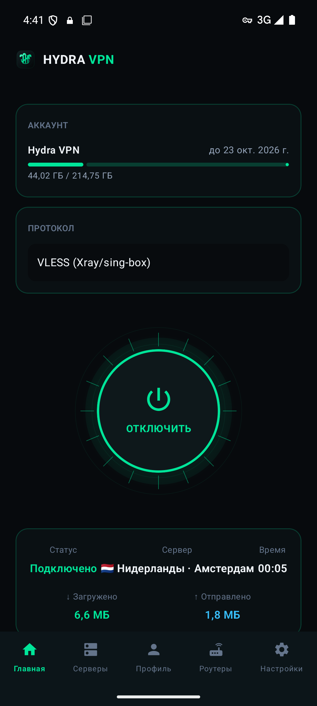 | 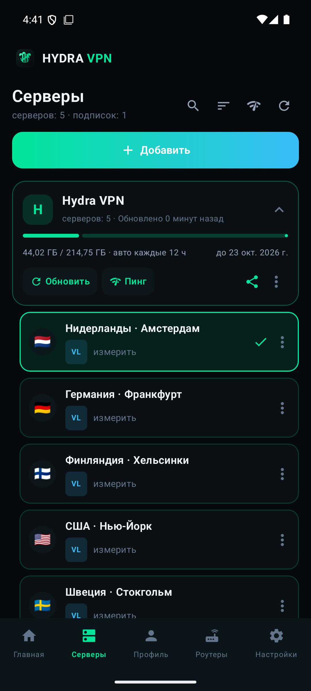 | 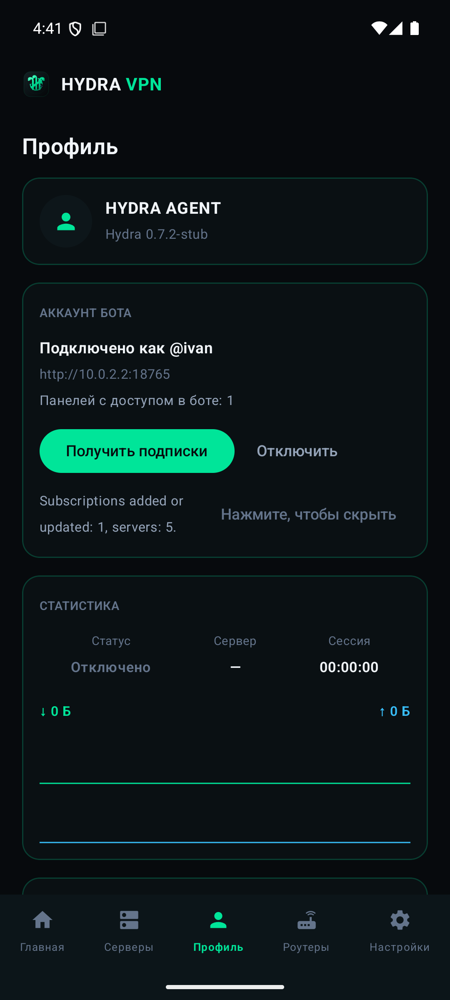 |

| Настройки | Маршрутизация | Ядра (Туннель) | Раздельное туннелирование |
|:---:|:---:|:---:|:---:|
| 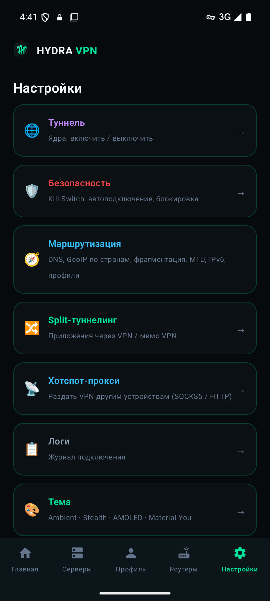 | 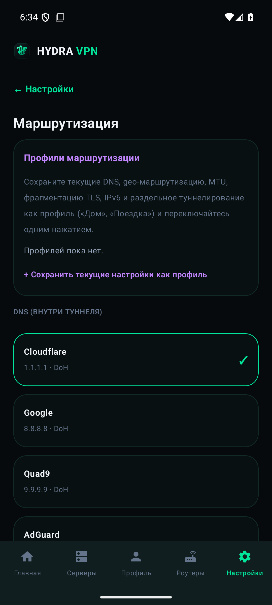 | 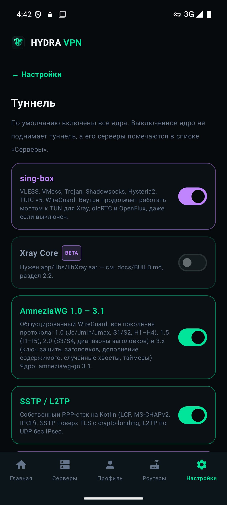 | 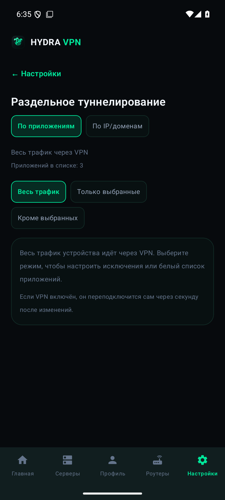 |

| Темы: Ambient · Stealth · Material You (0.7.9) | Выбор темы и иконки |
|:---:|:---:|
| 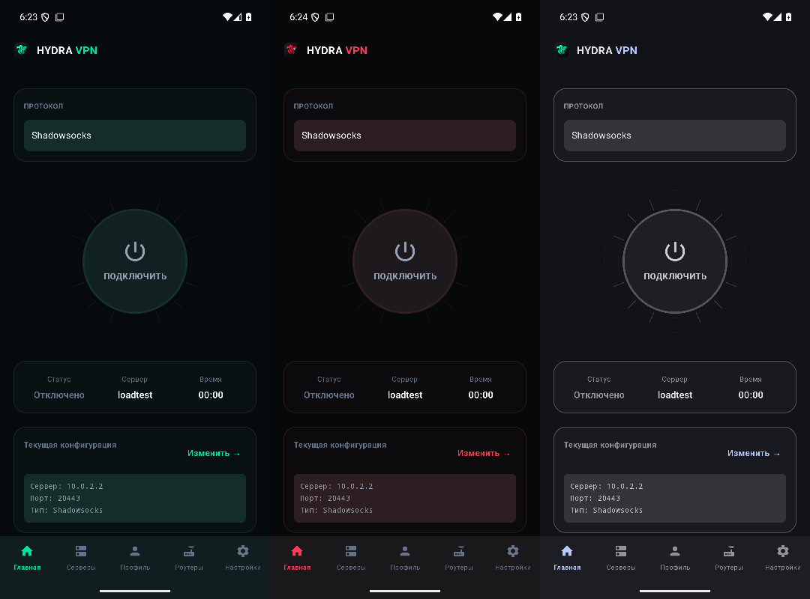 | 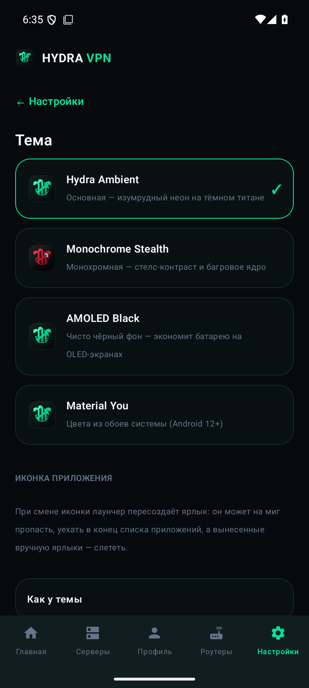 |

**Компьютер** (Windows / Linux / macOS, один и тот же интерфейс; данные демонстрационные)

| Главная (подключено, аккаунт) | Серверы |
|:---:|:---:|
| 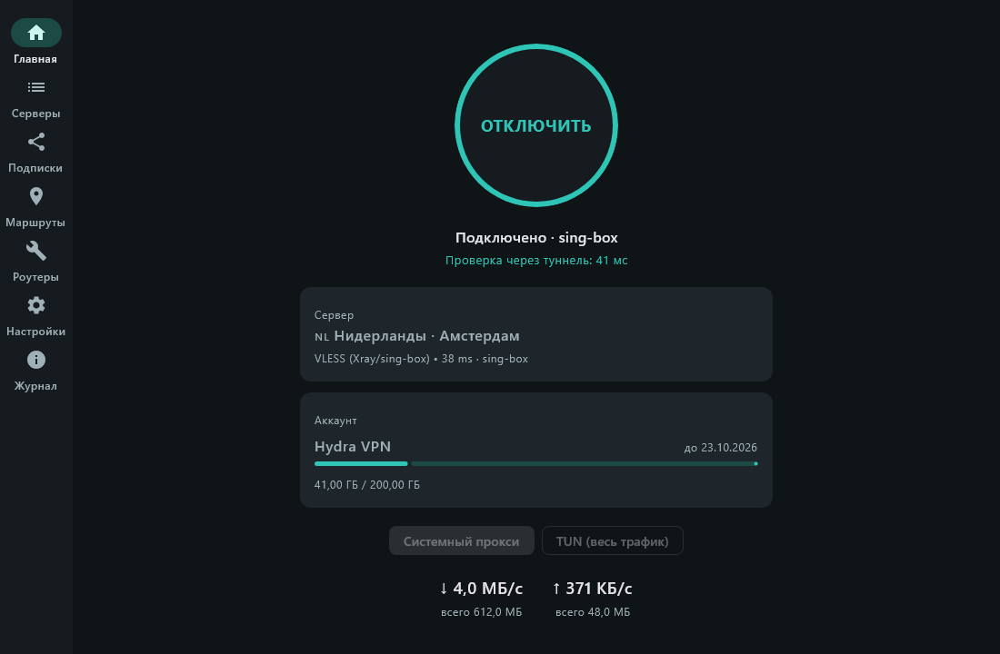 | 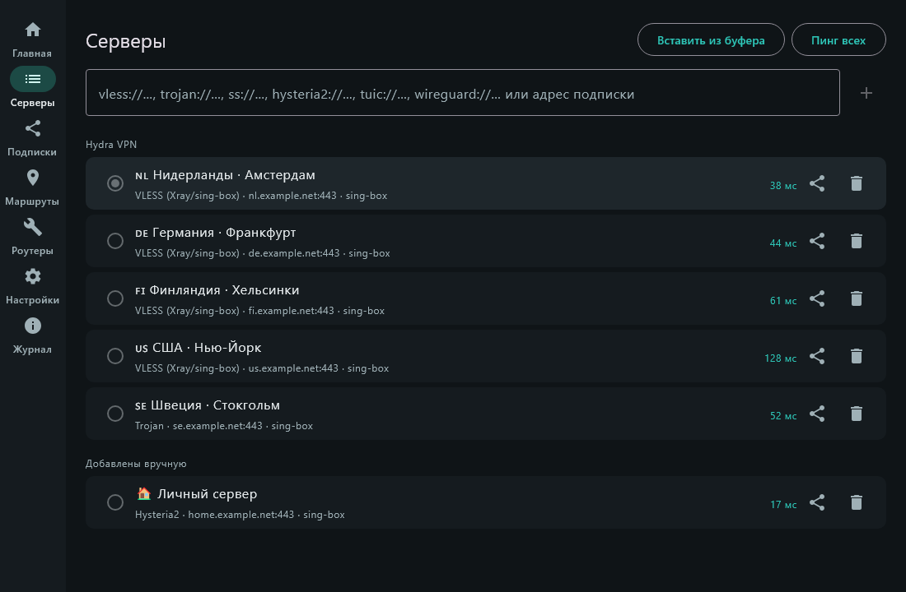 |

| Роутеры: узлы, разделы | Подписки |
|:---:|:---:|
| 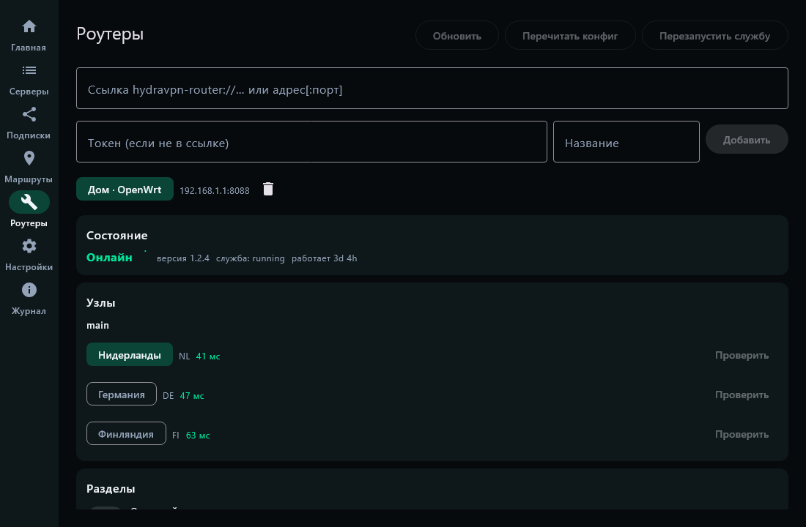 | 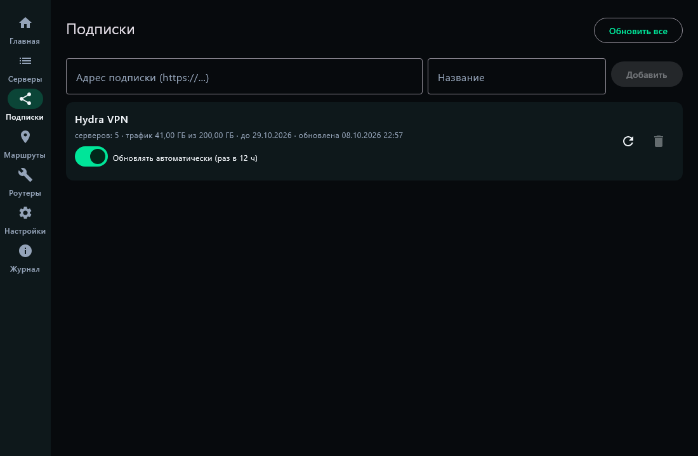 |

| Маршруты | Настройки |
|:---:|:---:|
| 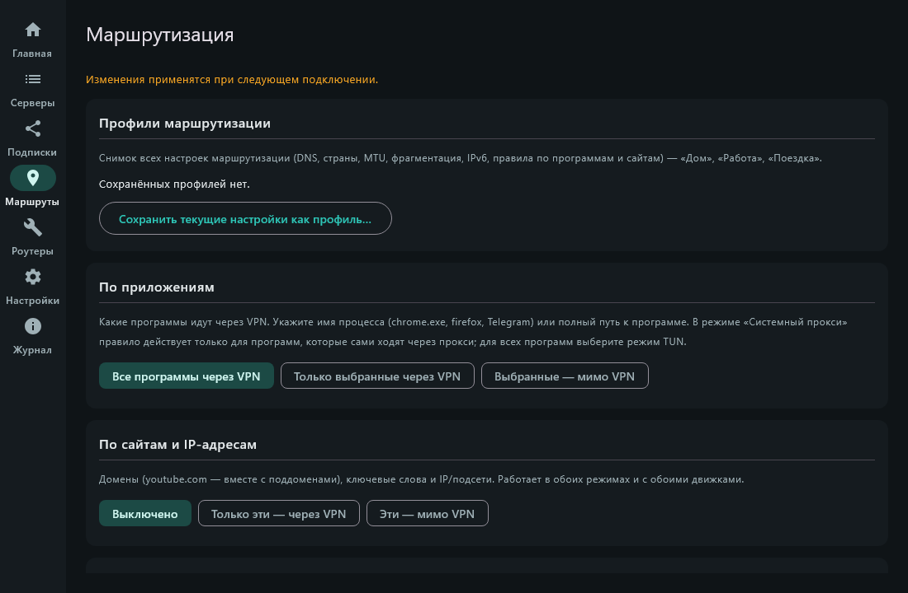 | 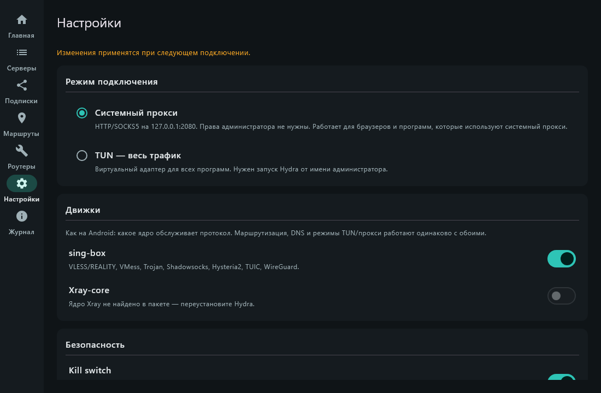 |

| Тема Monochrome Stealth | Тема AMOLED |
|:---:|:---:|
| 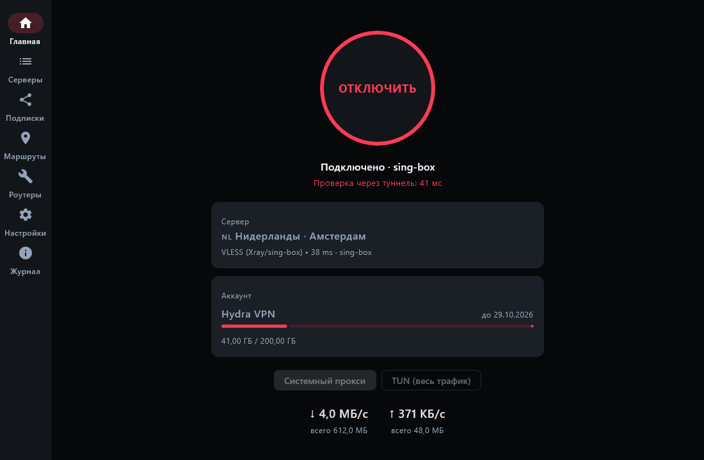 | 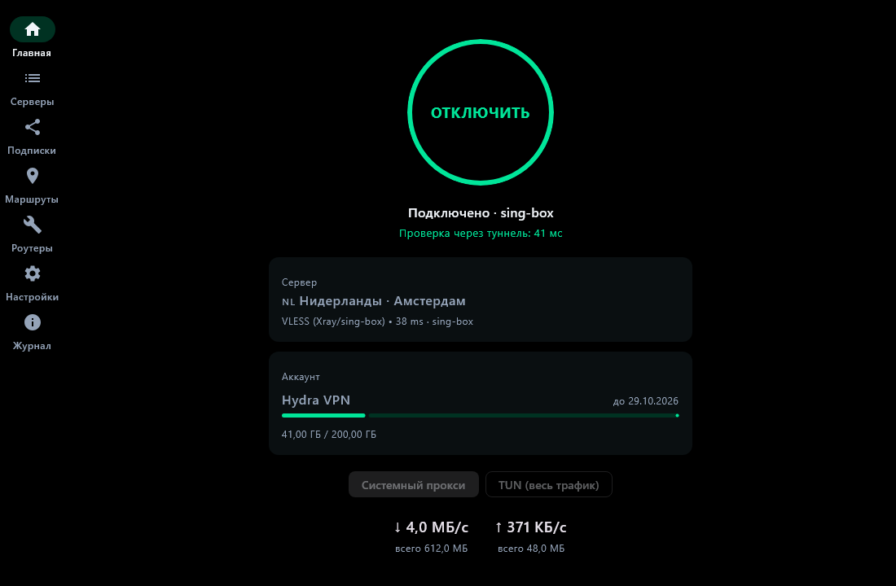 |

Hydra Classic (Windows 7 / 32-бит) — тот же набор экранов на Swing; iOS собирается только в macOS-CI, снимков с устройства пока нет.

> Снимки «Маршрутизация» и «Раздельное туннелирование» сняты до 0.7.14: теперь это вкладки одного раздела «Маршрутизация» (обновление снимков — в очереди, см. ROADMAP).

---

## Возможности

- 🎛 **Единый клиент** для нескольких семейств протоколов (что где доступно — таблица ниже):
  sing-box (VLESS/REALITY, VMess, Trojan, Shadowsocks, Hysteria2, TUIC, WireGuard), Xray, AmneziaWG 1.0–3.x,
  SSTP и L2TP (userspace-PPP на Kotlin, без root), olcRTC и OpenFlux (BETA); обход DPI — ByeDPI на всех платформах.
- 👤 **Аккаунт бота «Радар» (Hydra VPN)** — вход по одноразовому коду («VPN» → «Подключить приложение»):
  подписки, выданные в боте, заводятся сами и обновляются раз в 6 часов; смена ссылки у панели обновляет ту
  же подписку, выключенные в боте помечаются; на главном экране — срок и трафик. Токен хранится в Android
  Keystore / iOS Keychain / файле только для владельца на ПК. Для вошедших доступен приватный DNS Hydra VPN.
- 📡 **Управление роутером** [HydraVPN for Router](https://github.com/Chistovik92/HydraVPNforRouters)
  (OpenWrt, Keenetic, MikroTik): сопряжение по ссылке/QR с закреплением отпечатка TLS, статус, узлы и выбор
  узла, подписки («отправить на роутер» из Hydra), журнал, перезапуск. На ПК — ещё разделы (включить, править,
  добавить, удалить), подключение самого роутера к боту и диагностика.
- 📥 **Импорт**: подписки (base64/список) из панелей x-ui / 3x-ui / PasarGuard / Remnawave / Marzban, одиночные
  ссылки (`vless:// vmess:// trojan:// ss:// hysteria2:// tuic:// wireguard:// awg:// sstp:// l2tp://`), `.conf`
  WireGuard/AmneziaWG, QR (камера, фото), буфер обмена, deep-links; HWID для панелей.
- 🧭 **Маршрутизация** (0.7.13–0.7.14, [docs/ROUTING.md](docs/ROUTING.md)): один раздел с вкладками — **Приложения/Программы**
  (кто идёт через VPN и свой выход для приложения), **Сайты и IP**, **Обход DPI**, **Выходы**. Правила «приложение / домен / IP / страна /
  порт / протокол → выход» с «И»/«НЕ», группы выходов («авто» и «ручной»), цепочки «сервер через обход DPI или через другой сервер»,
  узлы на OpenFlux и olcRTC; выбор из выпадающих списков. DoH/DoT/UDP-DNS, фрагментация TLS, MTU, IPv6, **профили маршрутизации**
  («Дом», «Поездка»).
- 🛡 **Обход DPI без сервера** (ByeDPI, `ciadpi`): профиль «Обход DPI», трафик «напрямую» через обход, выход `dpi` в правилах. **Мастер подбора**
  стратегии (как в [ByeByeDPI](https://github.com/romanvht/ByeByeDPI), но с понятным итогом «открылось 11 из 12»): 60 готовых или свой список
  стратегий, списки доменов (Cloudflare, Discord, Googlevideo, соцсети, Telegram, YouTube… и свои), пауза, число запросов, параллельность,
  таймаут и SNI фейк-пакетов (0.7.15); найденную стратегию видно и копируется целиком.
- ✈️ **Telegram**: если не открывается даже через ByeDPI — **Telegram по WebSocket** (TG WS, 0.7.14; идея Flowseal/tg-ws-proxy и
  DmitryKafturov/tg-ws-proxy), без своего сервера; кнопка **«Подключить Telegram к прокси»** (0.7.15) в настройках и на главном экране.
- 🌐 **Geo-базы** как динамический слой (0.7.13): источники MetaCubeX, SagerNet, runetfreedom (в т. ч. `ru-blocked`), v2fly, свои списки;
  автообновление, проверка файла, откат; пресет «Заблокированное в РФ → обход DPI».
- ✂️ **Раздельное туннелирование**: по приложениям (Android) или программам (ПК), по IP/доменам, по странам; пресет «Российские приложения напрямую».
- 🎨 **Темы и значки** (0.7.9, 0.7.14): Ambient · Stealth · AMOLED · Material You (Android); значок приложения — 4 варианта и на ПК, с обновлением
  ярлыков Windows/Linux.
- 🛡 **Безопасность**: Kill Switch, переподключение, блокировка приложения отпечатком/PIN/Face ID, скрытие
  ключей на экране.
- 📱 **Вне приложения**: плитка и виджет (Android), виджет и Пункт управления (iOS), трей, автозапуск и раздача
  в локальную сеть (ПК); Android TV и планшеты.
- 🔄 **Обновления прямо из приложения** (см. «Скачать»).
- 🌍 Интерфейс Android и iOS: русский, английский, украинский, персидский, китайский (ПК — русский).

## Протоколы по платформам

| Протокол | Android | Windows / Linux / macOS | iOS |
|---|:---:|:---:|:---:|
| VLESS (+REALITY/Vision), VMess, Trojan, Shadowsocks, Hysteria2, TUIC, WireGuard (sing-box) | ✅ | ✅ | ✅ |
| Xray как второе ядро (не BETA) | ✅ | ✅ | — |
| AmneziaWG 1.0–3.x | ✅ | — | ✅ |
| SSTP, L2TP (без IPsec) | ✅ нужен тест на сервере | — | PPP-стек есть, транспорт ждёт проверки |
| olcRTC, OpenFlux (BETA) | ✅ | ✅ нужен свой узел/сервер (Classic — кроме Windows 7) | ✅ внутри расширения VPN (с 0.7.10, проверено сборкой) |
| Обход DPI (ByeDPI) и мастер подбора | ✅ | ✅ (Classic — тоже) | ✅ внутри расширения VPN (интерфейс 0.7.13; настроек подбора 0.7.15 пока нет) |
| Telegram по WebSocket (TG WS) | ✅ | ✅ (Classic — тоже) | — (в очереди) |
| PPTP | — недоступно (GRE требует root) | — | — |

Подробности и ограничения — [docs/PROTOCOLS.md](docs/PROTOCOLS.md), сервисы — [docs/SERVICES.md](docs/SERVICES.md).

## Быстрый старт (сборка)

```bash
git clone https://github.com/Chistovik92/HydraVPN.git
cd HydraVPN
gradle wrapper --gradle-version 8.9             # один раз
./gradlew :app:assembleStubDebug                # Android без ядер (симуляция), для разработки интерфейса
./gradlew :desktop:run                          # ПК (скачает ядро sing-box с проверкой SHA-256)
./gradlew :app:testStubDebugUnitTest :desktop:test
```

Реальные Android-туннели: положите `libbox.aar` (и при желании `libXray`, AmneziaWG, olcRTC) в `app/libs/`
([docs/BUILD.md](docs/BUILD.md)), затем `./gradlew :app:assembleNativeRelease`. iOS собирается на macOS
([ios/README.md](ios/README.md)). Релиз всех платформ — `scripts/release.sh`.

Приватный DNS для вошедших через бота — секрет сборки: свойство Gradle `hydraPrivateDns` или переменная окружения
`HYDRA_PRIVATE_DNS` (в CI — секрет репозитория); без него пункт скрыт.

> `gradle-wrapper.jar` в репозиторий не кладётся (бинарник) — CI генерирует его сам, локально: `gradle wrapper`.

## Архитектура (кратко)

```
HydraVPN/
├── app/       Android (Compose): UI → MainViewModel → репозитории (Room, DataStore) → HydraVpnService → VpnCore
│              (SingBoxCore, XrayCore, AmneziaWgCore, SstpCore/L2tpCore, OlcRtc/OpenFlux, NoopCore для stub)
├── shared/    Kotlin Multiplatform: модели, парсеры ссылок, билдеры конфигов sing-box/Xray, PPP-протокол,
│              маршрутизация (data/routing), обход DPI (data/dpi), Telegram по WebSocket (data/tgws), geo-базы (data/geo),
│              клиент роутера (router), клиент бота (bot), поиск и загрузка обновлений (update)
├── desktop/   Compose Desktop (Windows/Linux/macOS): sing-box и Xray процессами, TUN/прокси, kill switch
└── ios/       SwiftUI + Network Extension (Libbox), AmneziaWG-расширение, виджеты; общая логика — Packages/HydraKit
```

Подробно — [docs/ARCHITECTURE.md](docs/ARCHITECTURE.md), [docs/MULTIPLATFORM.md](docs/MULTIPLATFORM.md).
Состояние работ и что осталось — [docs/HANDOFF.md](docs/HANDOFF.md) и [docs/ROADMAP.md](docs/ROADMAP.md).

## Документация

- [docs/PROTOCOLS.md](docs/PROTOCOLS.md) — протоколы, форматы ссылок, ограничения
- [docs/ROUTING.md](docs/ROUTING.md) — маршрутизация, обход DPI (ByeDPI), подбор стратегий, Telegram по WebSocket, geo-базы
- [docs/SERVICES.md](docs/SERVICES.md) — сервисы и интеграции (SoftEther, WDTT, olcRTC)
- [docs/PANELS.md](docs/PANELS.md) — совместимость с панелями подписок
- [docs/ARCHITECTURE.md](docs/ARCHITECTURE.md) · [docs/MULTIPLATFORM.md](docs/MULTIPLATFORM.md) — устройство проекта
- [docs/BUILD.md](docs/BUILD.md) — сборка ядер и приложений · [docs/DISTRIBUTION.md](docs/DISTRIBUTION.md) — распространение
- [docs/SECURITY.md](docs/SECURITY.md) — политика безопасности · [docs/CONTRIBUTING.md](docs/CONTRIBUTING.md) — как контрибьютить
- [docs/ECOSYSTEM.md](docs/ECOSYSTEM.md) — olcRTC / OpenFlux / snolc / AmneziaWG: апстримы, статус, клиенты
- [docs/HANDOFF_ROUTERS.md](docs/HANDOFF_ROUTERS.md) — управление роутером: контракт API и что проверено
- [desktop/README.md](desktop/README.md) · [ios/README.md](ios/README.md) — клиенты для ПК и iOS
- [CHANGELOG.md](CHANGELOG.md) — детальный лог 0.1.0 → 0.7.16
- [docs/HISTORY.md](docs/HISTORY.md) — хронология версий с датами и коммитами, журнал идей
- [docs/LEGACY.md](docs/LEGACY.md) — 32-битные и старые системы: Android x86/TV, Hydra Classic (Windows 7, 32-бит), Windows XP

## Лицензия

GPL-3.0 — см. [LICENSE](LICENSE) и [THIRD_PARTY_NOTICES.md](THIRD_PARTY_NOTICES.md).
Компоненты: sing-box (GPL-3.0), Xray-core (MPL-2.0), amneziawg-go/wireguard-go (MIT),
hev-socks5-tunnel (MIT), ByeDPI (MIT), OpenFlux (GPL-3.0), olcRTC (WTFPL); 60 стратегий и сайты проверки — из ByeByeDPI (GPL-3.0);
Telegram по WebSocket — собственный код по идее Flowseal/tg-ws-proxy и DmitryKafturov/tg-ws-proxy (MIT). Бинарники ядер не распространяются в составе репозитория.

## Дисклеймер

Инструмент для доступа к **собственным** VPN-серверам и обхода сетевых
ограничений в законных целях. Соблюдайте законодательство своей юрисдикции.
